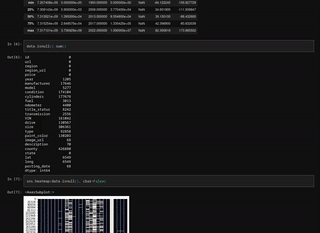
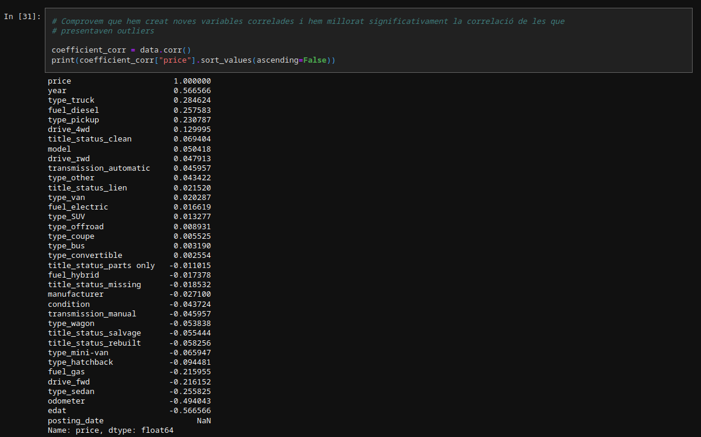

<h1 align="center">
  <br>
  Aprenentatge automàtic i desenvolupament d'un algoritme de tipus supervisat
  <br>
</h1>

<h4 align="center">Code and Jupyter Notebooks from my highschool <a href="https://linktr.ee/aprenentatgeautomatictdr" target="_blank">research paper</a>.</h4>

<p align="center">
  <a href="https://www.linkedin.com/in/biel-altimira-tarter/">
    
  </a>
</p>

<p align="center">
  <a href="#about-the-project">About the project</a> •
  <a href="#environment">Environment</a> •
  <a href="#data-source">Data source</a> •
  <a href="#house-prices">House prices</a> •
  <a href="#used-cars">Used cars</a>
</p>

<p align="center">
  
</p>
 
## About the project 

I developed a project studying Artificial Intelligence throughout history, analyzing different Machine Learning procedures, evaluating the ethics of the field and programming an algorithm able to predict prices of second hand vehicles and house value as a proof of all the gained knowledge.

## Environment
The project uses the `Python` programming language with some external modules such as `Pandas`, `Matplotlib`, etc. This repo also includes a `requirements.txt` file that allows you to install all the needed libraries to run the code and make the necessary changes.

If using an anaconda virtual environment, the following command creates a new environment with all the requirements:

```bash
conda create --name <env> --file <this file>
```

The development of the project can be followed through the `Jupyter Notebooks`, that provide a clear way to work with data. And also a `.pkl` file is provided as an export of the final model.

## Data source 
All the data used for these two projects was obtained thanks to the [Kaggle](https://www.kaggle.com/) platform. Although the data in CSV format is not included on this repo, these are the two contests that provide it:

  * > **[Used Cars Dataset](https://www.kaggle.com/datasets/austinreese/craigslist-carstrucks-data)** 
  * > **[Housing Prices Competition for Kaggle Learn Users](https://www.kaggle.com/competitions/home-data-for-ml-course)** 

Once within the notebook file, the data from a certain `Kaggle` contest can be imported using:

```python
!kaggle competitions download -c $name
```
## House prices
This first model served as an introduction to the dynamics of working with data and the `Jupyter Notebooks`. As one of my first data science projects, guidance was needed while working through the data.

The approach followed was:

  1. Gathering insight from the data
  2. Cleaning the data
     * Null values
     * Categories
     * Low correlation variables 
  3. Training the model
  4. Tuning the model
  5. Deploying

The model was uploaded to the Kaggle competition and categorized as valid despite not having a competitive score considering the leaderboard.

## Used cars
This second project, which was included in detain in the paper, used not all the new concepts learned in the last project but also all the details treated in the machine learning chapter of the written memory.

Therefore, more data manipulations were applied and greater results were achieved, using, in the end, a Gradient Booster Regressor with an $r^2$ around $0.92$. 



It must be taken into consideration that the model I studied in depth in the written memory was a `Linear Regression`, and therefore, the correlation coefficient was that major parameter used to determine the usability of the variables provided by the data. 
